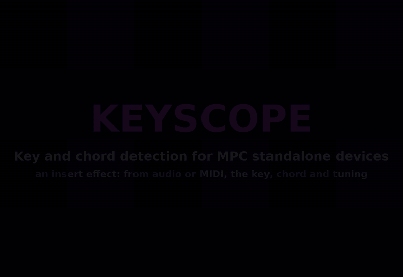

# Keyscope (MPC VST Plugin)

Key and chord detection for Akai MPC OS standalone devices (MPC Live/One/X/Key, Force), built as a native VST2
insert effect for MPC's own plugin host, with its own screen skin and Q-Links. Put it on any track and it listens to
whatever passes through it, a sample, a loop, a keyboard part or a whole mix, and names the **key**, the **chord**,
the **bass note** and the **tuning**. The audio passes through untouched. It all runs on the device.

**Status:** passes the offline tests (x86, ASan/UBSan and TSan), builds for armhf, its engine tests pass on the
device, and every function has been run on an MPC Key 37 (firmware 3.9.1.2) from the screen with chords playing
into it (`TESTING.md`).



The same tour as a video, recorded from the device screen while chords played into it and the touchscreen was
driven from a script: [docs/keyscope.mp4](docs/keyscope.mp4) (with captions).

## What it does

- **KEY**: a circle of fifths. The twelve major keys run round the outside a fifth apart, their relative minors
  inside. The key heard lights its six chords (I, IV and V outside, ii, iii and vi inside), and its name and the
  chord sounding now sit in the middle. Tap any key on the wheel to lock to it, tap it again to follow the audio.
  Beside it: how well the key matches (the correlation with the key profile, as a percentage), its relative, its
  scale notes and the three best candidates (tap one to lock to it too). KEY LOCK picks any key outright.
- **SOUNDING NOW**: twelve note tiles; the ones sounding right now light up. A line says which of them are outside
  the key.
- **CHORDS**: the chord heard now (major, minor, dim, aug, sus2, sus4, power chords, and with + 7THS the 7, maj7,
  m7 and m7b5 chords), with the bass note as a slash chord (C/E), and the chords before it.
- **HISTORY**: every key change with the time since listening started, the chord trail, the tuning and the
  loudest note.
- **SETUP**: MEMORY, PROFILE, RANGE, NOTATION, TUNING, CHORDS and GATE (below), and ANIMATION.
- **Tuning**: where the music sits against A = 440 (a band tuned to 432 Hz reads -32 cents), followed when TUNING
  is AUTO so a detuned recording still lands on the right notes.

## Using it

Add Keyscope as an insert on the track you want to read (Channel Mixer, an insert slot, the VST list). It reads
audio only: on a MIDI or plugin track it hears the instrument's output. On a drum or full-mix track, RANGE = MIDS keeps the kick and hi-hats out of the key.
Each instance reads its own track.

## Pages and Q-Links

| Page | Q-Links 1-4 |
|---|---|
| KEY | KEY LOCK, MEMORY, GATE, HOLD |
| CHORDS | CHORDS, RANGE, GATE, HOLD |
| HISTORY | MEMORY, GATE, HOLD, KEY LOCK |
| SETUP | MEMORY, PROFILE, RANGE, GATE |

RANGE picks the band analysed: FULL (50 Hz to 5 kHz), BASS (40-300 Hz, for a bassline), MIDS (120 Hz to 2 kHz,
keeps hi-hats and kick out), HIGHS (400 Hz to 5 kHz). NOTATION spells notes as the key does (AUTO), or always with
sharps or flats.

## How it works

The input is mixed to mono, low-passed and decimated to 11 kHz. Every 46 ms a worker thread (never the audio
thread) takes the last 371 ms, runs a 4096-point FFT, picks the spectral peaks (tones only: a click or a drum hit has none) and refines each one, and maps them
to the twelve pitch classes relative to the estimated tuning (a peak a quarter tone off a note counts for
nothing; a third or fifth harmonic of a stronger lower note is discounted as that note's colour). From that
chromagram:

- the **key** is the best of 24 rotated key profiles (Krumhansl-Kessler, Temperley, or a plain weighted scale)
  correlated with the chroma accumulated over MEMORY (10 s, 30 s, 1 min, or the whole song). The shown key moves
  only when another one has led by a margin for 1.5 s, and a relative (Ab major / F minor share every note) needs
  a larger lead;
- the **chord** is the best chord template against a 150 ms average, shown once it has won for 230 ms (a chord
  ringing into the next one is not a third chord), kept while nothing clear replaces it, cleared after silence;
- the **bass note** comes from the peaks under 260 Hz;
- the **tuning** is the circular mean of every peak's distance from the nearest note, over about 8 s.

Audio under GATE counts for nothing, so silence between songs doesn't pull the key around. HOLD freezes
everything; RESET forgets everything heard.

## Look

A synthwave sunset: the wheel is drawn into a striped sun over a neon grid. `vst/art/gen.py` draws the page
backgrounds as SVG (`vst/art/wheel.svg`, `vst/art/scene.svg`); the wheel's geometry there matches the ring tiles in
`vst/layout.conf`. `vst/skin.css` styles the panels and controls.

With ANIMATION on (SETUP; off by default), two mountain ridges slide past behind it, the far one at half speed:
sixteen frames of the mountain band (`vst/art/wheel_1..16.svg`, `scene_1..16.svg`), three a second, looping
seamlessly. The engine lights one of the hidden `bg_1`..`bg_16` parameters at a time and the skin shows that frame's
picture.

## Performance

On an MPC Key 37 (mpc-vst-plugins' `tools/bench.sh`, `vst/bench.txt`): worst p99 5.3% of the 2.9 ms block, worst
block 11%, the analysis thread about 1% of a core: PASS. Most of the audio-thread cost is the wrapper polling the
lit tiles and the animation frames every 10 ms, not the analysis.

## Building

Needs Docker (with QEMU for arm32v7) and a checkout of
[mpc-vst-plugins](https://github.com/sd88me/mpc-vst-plugins) next to this repo (or `MPC_VST=/path`).
Until [mpc-vst-plugins#90](https://github.com/sd88me/mpc-vst-plugins/pull/90) is merged, use that pull
request's branch (`qlink-travel` of [jacob-sabella/mpc-vst-plugins](https://github.com/jacob-sabella/mpc-vst-plugins)):
Keyscope relies on its wrapper and skin changes (tiles lit from the engine, momentary tiles, 47-character readouts,
`theme_tile_on`, `scale_names`, a picture's frames drawn under the panels). The wrapper's host test also needs the
fork's `host-test-effect` fix to run an effect.

```sh
vst/test.sh              # offline: detectors, engine, settings, bad input, real time (ASan, TSan), the host test
vst/build.sh             # vst/build/keyscope.so, the skin and pluginlist-entry.xml (armhf, glibc <= 2.32)
tests/device.sh <host>   # the engine tests built for armv7 and run on a device over ssh (MPC is not touched)
```

`TESTING.md` lists every test and the on-device checklist. `vst/art/gen.py` redraws the page backgrounds and the
animation frames.

### Releasing

`.github/workflows/release.yml` builds a draft release with mpc-vst-plugins' reusable workflow once that pull
request is in (bump the pins in it and in `test.yml` to the merge commit). Until then, release by hand from the
branch above, as mpc-vst-plugins' `docs/RELEASING.md` describes. Versions stay 0.x.y until it is merged.

```sh
B=vst/build; python3 $MPC_VST/tools/release.py --so $B/keyscope.so --skin "$B/skin/jacob-sabella - VST - Keyscope" \
  --entry $B/pluginlist-entry.xml --version 0.2.0 --repo jacob-sabella/mpc-vst-keyscope --license MIT \
  --bench vst/bench.txt -o dist
python3 $MPC_VST/tools/catalog_check.py dist/Keyscope-0.2.0-mpc-armv7.zip --catalog --expect-id keyscope \
  --expect-repo jacob-sabella/mpc-vst-keyscope
```

`tested.json` lists the devices and firmwares a version has been tested on (the catalog shows it as "Tested on").

The engine is plain C on mpc-vst-plugins' generic wrapper (`wrapper/engine.h`, `vst2_wrap.c`):

- `src/analyzer.c`: the decimator, the FFT and peak picking, tuning, the chromagram, the key profiles, chord
  templates, the bass note and the key-change log. No allocation and no locks; tested on its own
  (`tests/analyzer_test.c`).
- `src/keyscope.c`: the plugin: parameters and saved state, the audio thread (pass-through, decimation, a ring of
  the last 371 ms), the worker thread that runs the analysis, every readout and lit tile, and the animation clock.

Parameters are append-only (projects and Q-Links store them by index): add new ones at the end of
`vst/params.json`.

## License

MIT, see [LICENSE](LICENSE).
